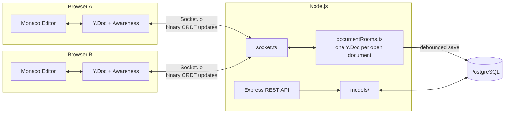

# Collab Editor

A real-time collaborative text editor — multiple people editing the same
document simultaneously, seeing each other's cursors and changes instantly,
like a minimal Google Docs. Built to explore CRDT-based collaborative editing
end to end: auth, real-time sync, presence, permissions, and version history.

For a detailed, code-referenced walkthrough of *how* each feature works and
*why* it's built the way it is — including two real bugs found and fixed
during development — see [PROGRESS.md](PROGRESS.md).

## Features

- Email/password auth (JWT)
- Create documents, list them, share by link
- Real-time collaborative editing (Monaco editor + Y.js CRDT + Socket.io)
- Live colored cursors and selections, with each user's name
- Online presence ("who's here right now")
- Automatic + manual version history, with restore
- Owner / editor / viewer permissions, enforced server-side (not just hidden
  in the UI)
- Rate-limited auth endpoints, Zod-validated request bodies, Helmet security
  headers
- Playwright E2E tests exercising two independent user accounts
  collaborating in real browser contexts

## Architecture



The core idea: every open document has one **Y.Doc** (a CRDT — a data
structure designed so concurrent edits from multiple people always merge
deterministically, no manual conflict resolution) on the server, and one in
each connected browser. Keystrokes become small binary "updates" relayed
over Socket.io; cursor position and presence use the same Y.js ecosystem's
`Awareness` protocol as a separate, non-persisted channel. Postgres only
ever sees the final plain text, written on a debounce after edits settle —
it has no idea a CRDT was involved.

See [PROGRESS.md](PROGRESS.md) for the full breakdown of each layer, with
the actual code and the reasoning behind it.

## Running it locally

Prerequisites: Node.js, PostgreSQL running locally.

```bash
# 1. Database
psql -U postgres -c "CREATE DATABASE collab_editor;"

# 2. Backend
cd server
cp .env.example .env   # fill in DATABASE_URL and a JWT_SECRET
npm install
npm run migrate
npm run dev             # http://localhost:4000

# 3. Frontend (separate terminal)
cd client
npm install
npm run dev              # http://localhost:5173
```

## Running the E2E tests

```bash
cd client
npx playwright install chromium   # first time only
```

In one terminal (rate limiting disabled so the suite's own user registrations don't trip it):
```bash
cd server
NODE_ENV=test npm run dev
```

In another terminal:
```bash
cd client
npm run dev
```

Then:
```bash
cd client
npm run test:e2e
```

## Known limitations (deliberately not fixed — see why)

**Single server instance only.** Each open document's `Y.Doc` lives in that
one Node process's memory (`documentRooms.ts`). A naive fix — adding
`@socket.io/redis-adapter` so Socket.io messages route across multiple
server instances — is not enough on its own for this app, and would be
actively misleading to bolt on without addressing the deeper issue: two
server instances would each hold their **own independent copy** of the same
document's `Y.Doc`. The Redis adapter only relays *socket messages* between
instances' connected clients; it does not reconcile the two instances' own
in-memory CRDT state or their independent debounced Postgres saves — which
could silently race and overwrite each other's content. A correct solution
needs either (a) sticky routing so every connection for a given `documentId`
always lands on the same instance, or (b) replacing the in-memory `Y.Doc`
store with something like [`y-redis`](https://github.com/yjs/y-redis),
purpose-built to keep Y.js document state itself consistent across
processes. Neither was implemented here — this is flagged as the honest
next step rather than shipped half-working.

**No offline support.** The `Y.Doc` exists only in browser memory; a page
refresh mid-disconnect loses any unsent edits. Adding
[`y-indexeddb`](https://github.com/yjs/y-indexeddb) to mirror the document
into the browser's IndexedDB would fix this.

**JWTs can't be revoked.** A 7-day token is valid until it expires, with no
server-side session to invalidate on logout. A refresh-token pattern would
close this gap.

## Tech stack

- **Frontend:** React, TypeScript, Monaco Editor, Y.js, Socket.io-client
- **Backend:** Node.js, Express, Socket.io, Y.js, y-protocols
- **Database:** PostgreSQL
- **Testing:** Playwright (E2E)
